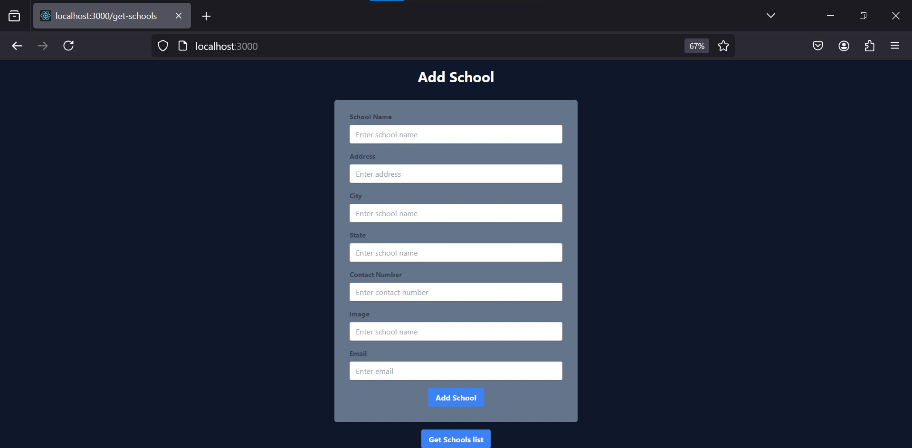
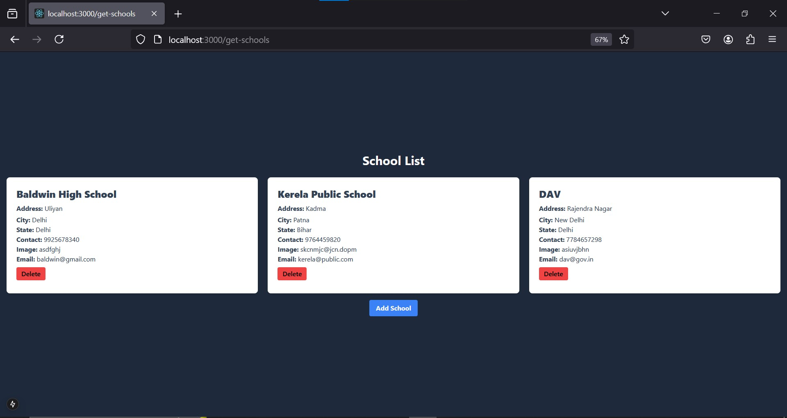

# **School List Project**

The **School List** project is a full-stack web application built using **Next.js 14**. It allows users to add, view, and delete schools from a database. The project uses **MySQL** as the database.

## **Features**

- **Add Schools**: A responsive form to add school details to the database.
- **View Schools**: A list displaying school names, addresses, and cities in a grid layout.
- **Delete Schools**: Ability to delete a school entry directly from the list.
- **Responsive Design**: Optimized for both desktop and mobile devices.

---

## **Technologies Used**

- **Frontend**: Next.js, React.js, TailwindCSS
- **Backend**: Next.js API routes
- **Database**: MySQL
- **Form Validation**: react-hook-form
- **HTTP Requests**: Fetch API

---

## **Database Setup**

### **Database Name**

```sql
schools
```

### **Table Name**

```sql
schoolLists
```

### **Table Structure**

```sql
CREATE TABLE schoolLists (
  id INT AUTO_INCREMENT PRIMARY KEY,
  name VARCHAR(255) NOT NULL,
  address TEXT NOT NULL,
  city VARCHAR(255) NOT NULL,
  state VARCHAR(255) NOT NULL,
  contact VARCHAR(20),
  image TEXT,
  email_id VARCHAR(255),
  created_at TIMESTAMP DEFAULT CURRENT_TIMESTAMP
);
```

---

## **Installation**

1. **Clone the repository:**
   ```bash
   git clone https://github.com/Mukeshzz/School-List.git
   cd school-list
   ```

2. **Install dependencies:**
   ```bash
   npm install
   ```

3. **Configure Environment Variables:**

   Create a `.env` file in the root directory and add the following:

   ```env
   DB_HOST=localhost
   DB_PORT=your_port
   DB_USER=root
   DB_PASSWORD=your_password
   DB_DATABASE=schools
   ```

4. **Run the development server:**
   ```bash
   npm run dev
   ```

5. **Access the application:**
   Open [http://localhost:3000](http://localhost:3000) in your browser.

---

## **Usage**

### **1. Add a School**

 **Add School** page and fill out the form. Ensure all inputs are valid before submitting.

### **2. View Schools**

The homepage displays a list of all schools stored in the database. You can view the school’s name, address, and city in a card layout.

### **3. Delete a School**

Each school card has a **Delete** button. Click the button to remove the school from the database. A confirmation prompt will appear after deletion.

---

## **Project Structure**

```
school-list/
├── src/
│   ├── app/
│   │   ├── api/
│   │   │   ├── school/
│   │   │   │   ├── addSchool/route.js    # Add school API
│   │   │   │   ├── getSchool/route.js # Get schools API
│   │   │   │   ├── deleteSchool/route.js # Delete school API
│   │   ├── get-school/
│   │   │   ├── page.js             # School List Page
│   │   |
│   │   ├── page.js                 # Add School Page
│   ├── config/
│   │   ├── db.js                   # Database connection
├── public/
├── .env                            # Environment variables
├── README.md                       # Project documentation
```

---

## **API Endpoints**

### **Add School**
- **Method**: `POST`
- **Endpoint**: `/api/school/add`
- **Request Body**:
  ```json
  {
    "name": "School Name",
    "address": "School Address",
    "city": "School City",
    "state": "School State",
    "contact": "1234567890",
    "image": "text",
    "email_id": "school@example.com"
  }
  ```

### **Get Schools**
- **Method**: `GET`
- **Endpoint**: `/api/school/getSchool`

### **Delete School**
- **Method**: `DELETE`
- **Endpoint**: `/api/school/delete?id={school_id}`

---

## **Future Enhancements**

- Add search and filter functionality.
- Include pagination for large datasets.
- Add the ability to edit school details.

---

## **Screenshots**

### **Add School Page**



### **School List Page**



---

## **License**

This project is open-source and free to use under the MIT License.

---
